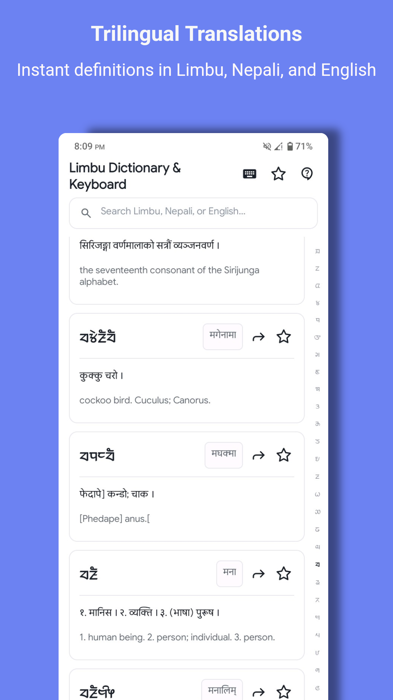
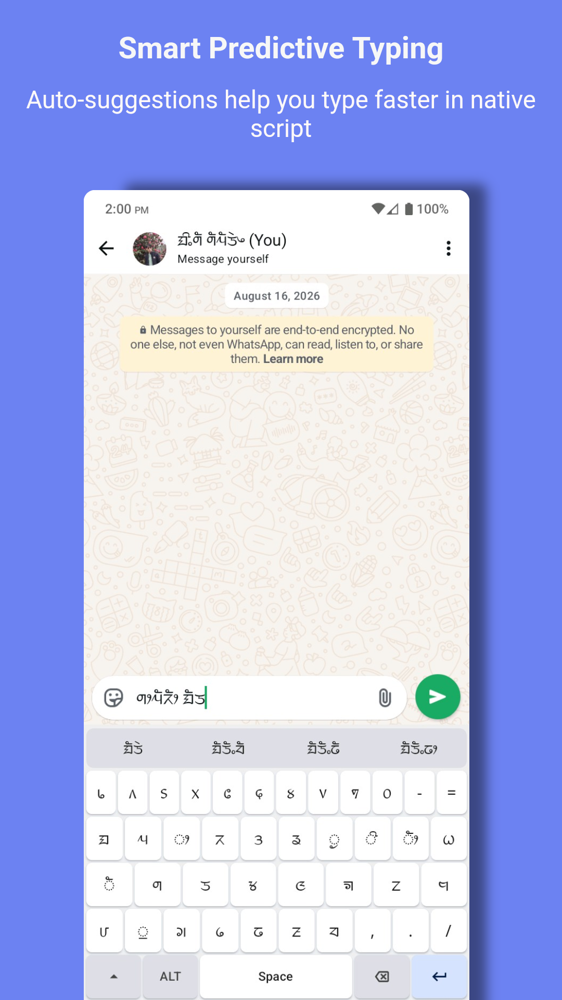
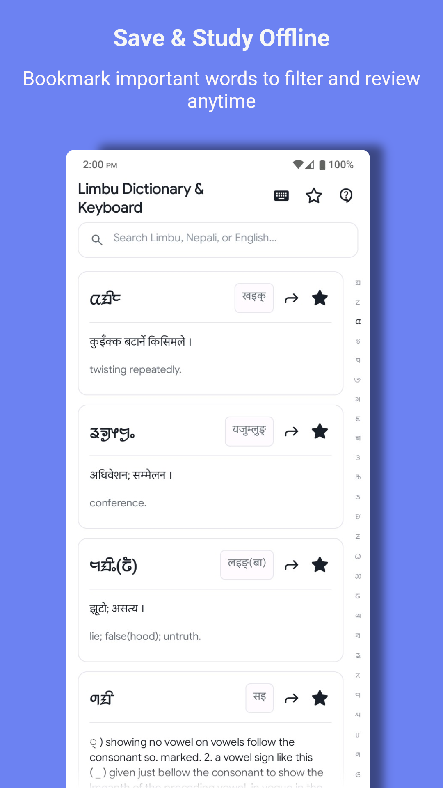

# Limbu Dictionary & Keyboard

<p align="center">
  
</p>

<p align="center">
  <b>Offline Limbu dictionary with an integrated native Sirijanga script keyboard.</b>
</p>

<p align="center">
  <a href="LICENSE"></a>
  <a href="https://developer.android.com"></a>
  <a href="https://github.com"></a>
</p>

---

## 📱 App Screenshots

<p align="center">
  
  &nbsp;&nbsp;
  
  &nbsp;&nbsp;
  
  &nbsp;&nbsp;
  
</p>

---

## 📖 About the Project

**Limbu Dictionary & Keyboard** is an open-source Android application dedicated to preserving, promoting, and modernizing the **Limbu (Yakthung) language** and **Sirijanga script**.

Designed as a lightweight, fast, and feature-rich utility, it functions completely offline as a trilingual dictionary and includes an integrated native **Sirijanga IME (Input Method Editor) Keyboard** allowing users to type Sirijanga script across any Android application.

---

## ✨ Features

### 📚 Trilingual Dictionary
- Search across **8,800+ words** in Limbu, English, and Nepali
- Exact & partial match search engine
- Quick alphabet bar (`ᤀ` to `ᤜ`) for smooth scrolling
- One-tap sharing of definitions
- Offline bookmarking

### ⌨️ Native Sirijanga IME Keyboard
- System-wide input support
- Smart auto-suggestions & word completion
- Clipboard manager
- Built-in emoji picker
- Haptic & audio feedback
- Light/Dark themes

### 🔄 Offline-First
- Instant offline access with local assets
- Silent background sync when connected

---

## 🛠️ Tech Stack

- **Language**: Java / Kotlin
- **UI**: Native Android, Custom XML
- **Data**: Gson
- **Architecture**: IME Service, InputMethodService, BaseAdapters

---

## 🚀 Getting Started

### Prerequisites
- Android Studio or CodeAssist
- Android SDK (API 21+)
- Target SDK: API 36

### Build
```bash
git clone https://github.com/ingsha09/limbu-dictionary-keyboard.git
cd limbu-dictionary-keyboard
./gradlew assembleDebug
```

### Install
```bash
adb install app/build/outputs/apk/debug/app-debug.apk
```

### Enable Keyboard
Settings → System → Languages & Input → Virtual Keyboard → Manage Keyboards → Enable Limbu Keyboard

---

## 🤝 Contributing

1. Fork the Project
2. Create Feature Branch (`git checkout -b feature/AmazingFeature`)
3. Commit Changes (`git commit -m 'Add AmazingFeature'`)
4. Push (`git push origin feature/AmazingFeature`)
5. Open a Pull Request

---

## 📄 License

Distributed under the MIT License. See `LICENSE` for more information.

---

## 🏢 Support

Developed by **Ingsha Hang Subba** under **Kiso Labs**

- **API**: [limbu-dictionary-api](https://github.com/ingsha09/limbu-dictionary-api)
- **Donate**: [Razorpay](https://razorpay.me/@ingshahangsubba)
- **Email**: ingshalimbu09@gmail.com

---

⭐ **If you find this useful, please star the repo!**
